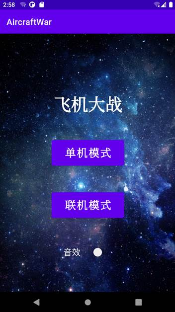
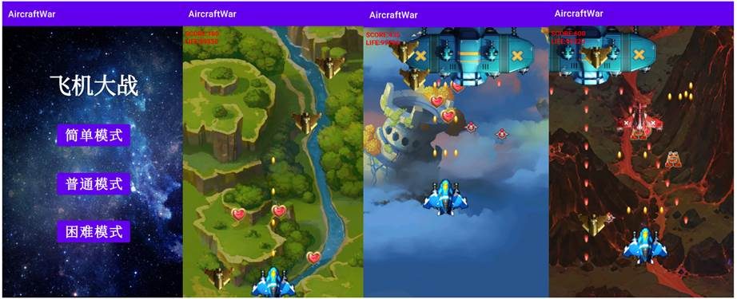
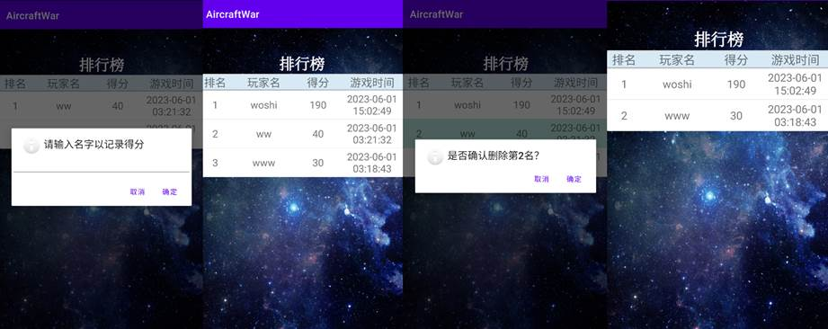
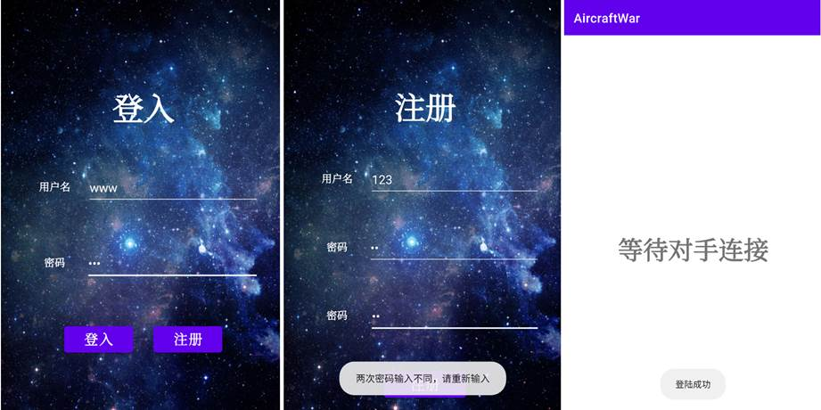
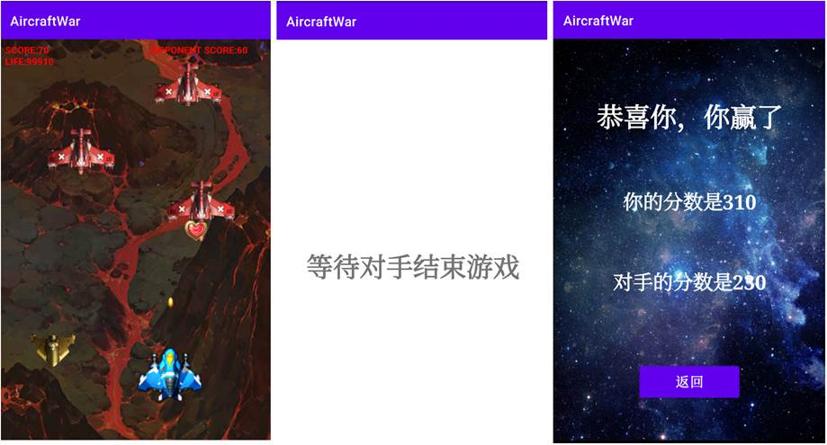

此项目为面向对象的软件构造实践课程代码，即飞机大战的安卓版，本 `README.md` 节选自结题报告

## 1  系统核心功能运行结果与分析

本飞机大战应用分为**单机模式**和**联机模式**，玩家可在主菜单中进行选择，并且决定是否开启音效

 

**单机模式：**

选择三种难度，这部分与PC端无差异

上图的各个子图从左到右展示了排行榜的功能。当当玩家死亡后，会进入排行榜页面，玩家可选择输入自己的名字。若输入为空或取消时则不计入分数。输入后可以看到当前模式下的排名。单击某行可选择删除某次游戏数据。删除后排行榜更新。

 

 

**联机模式：**

 

 

点击联网模式后进行登入界面，若为注册账号则可在注册界面进行注册，注册时会进行密码验证。若成功登录，则会进入等待界面，等待对手连接

当对战双方连接成功时，会进入对战模式，己方可以看见对手分数。当己方英雄机先死亡时，会进入等待界面，等待对手结束游戏。当双方均结束游戏后，会进入结果界面，界面会显示双方分数，并给出输赢结果。点击返回按钮可返回至最初主菜单界面。

 ## 2 总结

本项目对Java飞机大战的本地PC版进行了安卓开发移植和改进。

- 安卓开发的主要流程包括创建项目、编写代码、配置界面布局、处理事件和调试运行。安卓开发的核心是Activity和layout，它们负责处理界面和交互。

- 开发推荐使用SQLite数据库来存储排行榜信息和用户信息。在安卓开发中，我们可以使用SQLiteOpenHelper类来管理数据库的创建和升级。

- 本项目使用Socket进行数据通信，实现了联机对战功能。在同步对手分数的过程中，若需通信大量数据（如部分同学传递了对手英雄机的坐标等信息，另创建一个”对手英雄机“以可视化对手实时行为）则推荐使用Jackson库进行JSON序列化，实现了数据的高效传输和解析。

若学弟学妹们需要参考代码，可查看[链接项目](https://github.com/YounG-0516/AircraftWar_APP) ，该项目实现较为完善。[该项目](https://github.com/YounG-0516/AircraftWar-App-Server)为相应的服务器端代码